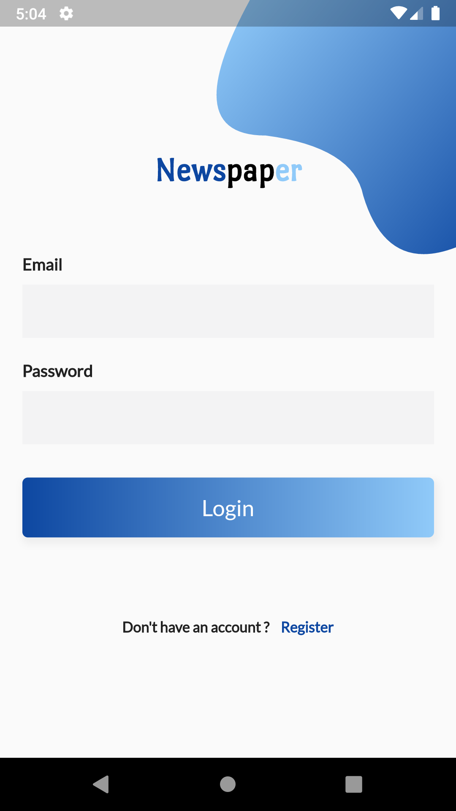
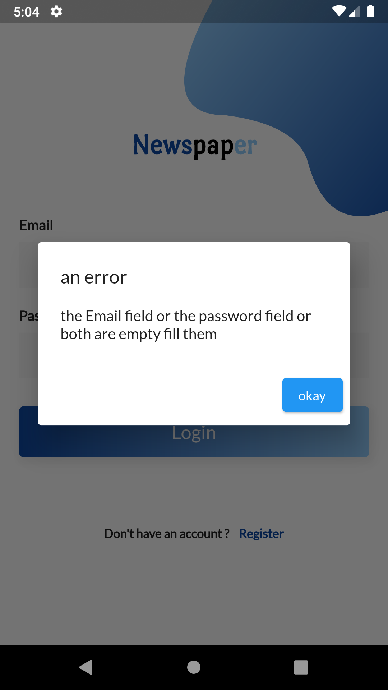
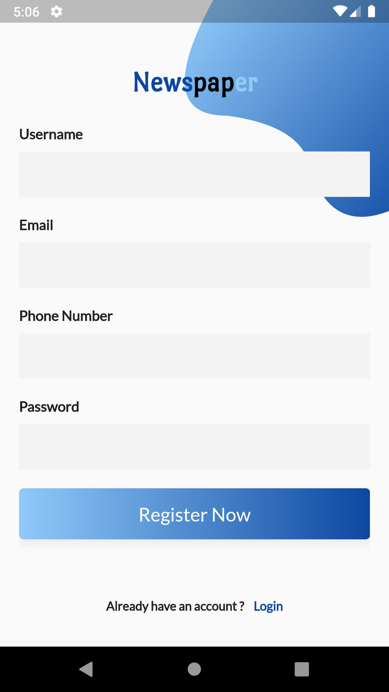
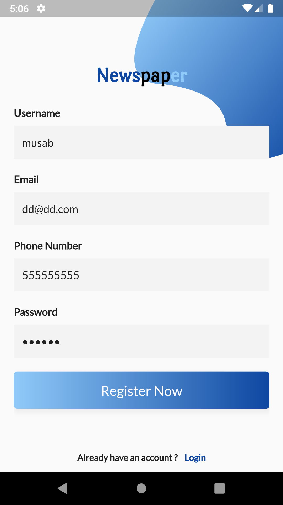
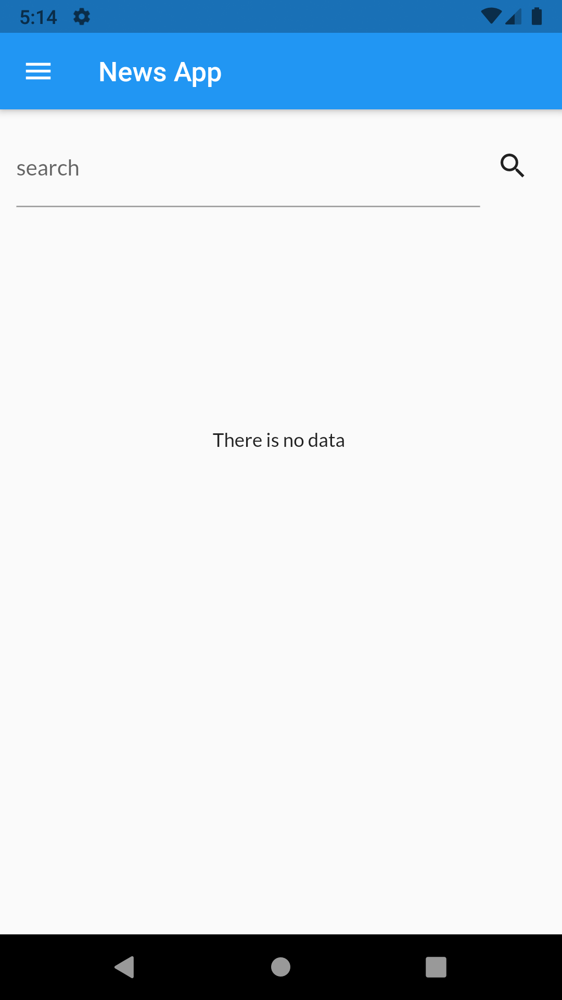
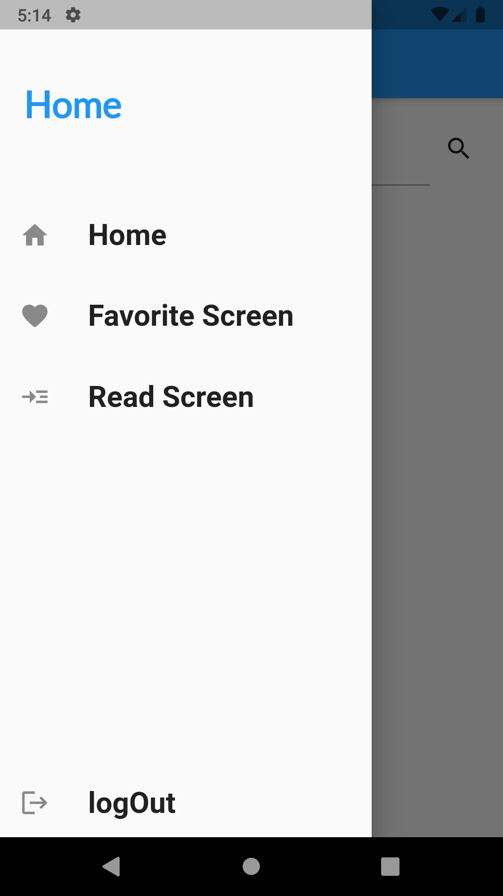
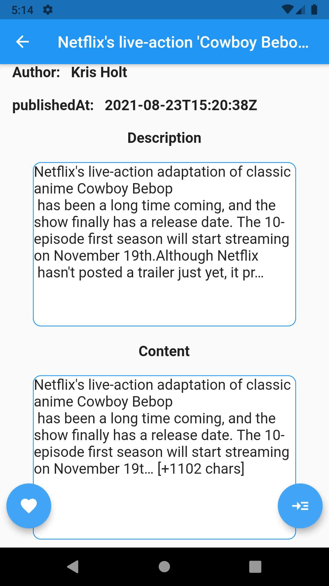
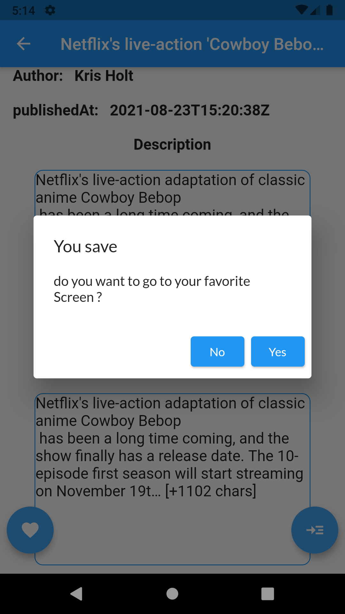
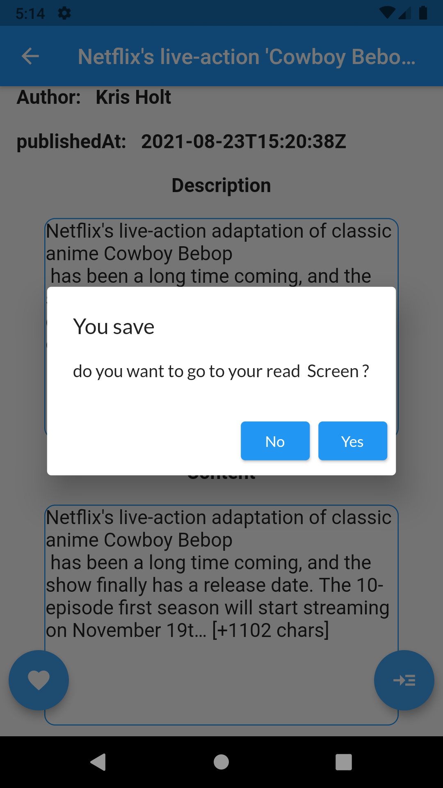

# skys_tasks

A new Flutter project. that i make for sky line company as a Task

## what do i learn by building this project ?
1. styling the Widget and make the themes
3. navigation inside flutter 
4. routse system inside flutter  
5. passing  data  front back 
6. using Provider
7. Authentction
8. RealTime database from Firebase
8. Authentction  from Firebase

# Image

### still to go later ,
1. fix auto log in  
2. auth base on user
3. add id database 

